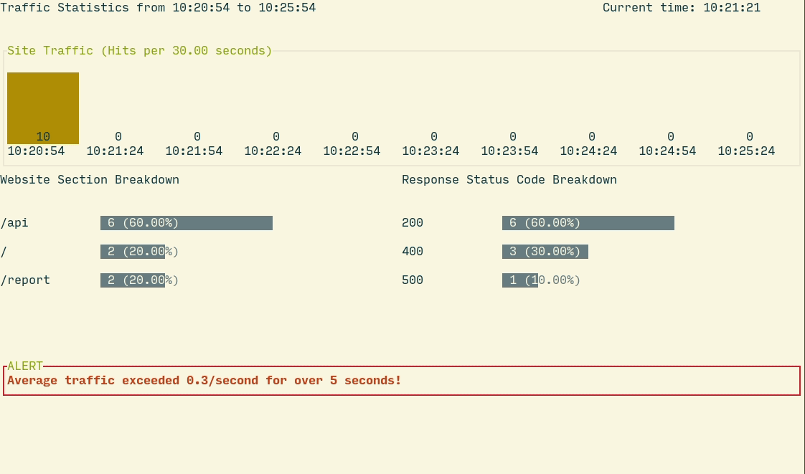

# logr
> A command-line dashboard for monitoring logs written in Go

**This is a toy project NOT recommended for production use!**

Logr is a command-line dashboard for monitoring actively-written-to [W3C-formatted](https://www.w3.org/Daemon/User/Config/Logging.html) server logs.

## Features
- Real-time monitoring dashboard showing site traffic and statistics
- Breakdown of top website sections (root URL paths) and response codes
- Alerts when average traffic exceeds a threshold (default 10 hits/second for over 120 seconds)
- Configurable monitoring window and granularity
- Thorough test coverage
- Available as a standalone binary
- Persists offset into log file: if you quit Logr and re-run it on the same log file, it will pick up where it left off and not miss any data points

## Installation and Usage
Logr can be installed as a standalone binary via [`go get`](https://golang.org/cmd/go/):

    $ go get github.com/jdormit/logr
	
Alternatively, you can build it from source:

    $ git clone https://github.com/jdormit/logr
	$ cd logr
	$ go install

Logr will then be available as `$GOPATH/bin/logr`:

    $ logr -h
    A small utility to monitor a server log file

    USAGE:
      logr [OPTIONS] [log_file_path]
    
    ARGS:
      log_file_path
            The path to the log file to monitor (default /tmp/access.log)
    
    OPTIONS:
      -h, -help
            Display this message and exit
      -alertInterval int
        	The interval of time in seconds during which the number of requests per second must exceed the alert threshold to trigger an alert (default 120)
      -alertThreshold float
        	The average number of requests per second over the alerting interval that will trigger an alert (default 10)
      -dbPath path
        	The path to the SQLite database (default "/home/jdormit/.local/share/logr/logr.sqlite")
      -debugLogPath path
        	The path to the file where logr will write debug logs (default "/home/jdormit/.local/share/logr/logr.log")
      -granularity int
        	The granularity of the traffic graph, i.e. the number of buckets into which traffic is divided. (default 10)
      -timescale int
        	The size of the reporting time window in minutes (default 5)
			
Basic usage is simple: `logr /path/to/file.log` will start tailing `file.log` and reporting metrics to a dashboard in the current terminal. 

By default, Logr will display metrics over a 5-minute period, bucketing traffic into 10 30-second slices over the current reporting period. This can be customized with the `-timescale` and `-granularity` options, which set the time period in minutes and the number of buckets respectively.

An alert will be displayed if the average traffic/second is greater than 10 for the last 2 minutes. These values can be customized with the `-alertThreshold` and `-alertInterval` options, e.g. `-alertThreshold 5 -alertInterval 60` will trigger an alert if the average traffic/second is greater than 5 for over 60 seconds.

## Architecture and Design Tradeoffs
Logr was designed to be consumed by a human actively watching the dashboard. This supports a very different set of use cases than a tool designed to be run in the background and consumed by machines. I focused on creating an easy-to-digest dashboard UI rather than ensuring interoperability with other programs.

The archicture of Logr optimizes for maintainability and extensibility. At a high level, there are two important systems - the log tailer/persister and the UI loop. Each system is implemented as a [goroutine](https://golang.org/doc/effective_go.html#goroutines) and runs independently. 

The tailer/persister system tails the log file for updates and persists them to a SQLite database. It provides querying via the `timeseries.LogTimeSeries` struct, which has methods for querying various timeseries data about the persisted log lines.

The UI loop runs in a separate goroutine. It reads data from the database every second and listens for UI events such as `C-c` or resizing the terminal window. Then it updates the UI based on the data read.

This architecture cleanly separates concerns. By keeping the log persistence layer separate from the UI layer, a door opens to writing other clients for the timeseries data - for example, another command could read the data and generate machine-readable reports.

## Improvements
There are a few improvements that could be made to Logr. As mentioned above, Logr does not provide machine-readable data, so running it as a daemon would be useless. A more useful design would be providing additional commands that run Logr as a daemon and write the monitoring statistics in a machine-readable format, e.g. as structured lines or JSON logged to STDOUT.

Logr also supports a really flexible reporting time window, but doesn't expose real-time controls to that window. Although users can set the reporting window and granularity via command-line arguments, it would be more useful to define keyboard shortcuts to change the interval and granularity in real-time while the dashboard is running. In addition, Logr currently only displays the time window from the current time to `interval` minutes in the future, and slides that time window when the current time exceeds the end of the reporting the interval. The reporting logic itself supports querying arbitrary time windows, so it would be a big useability improvement to add keyboard shortcuts and UI that allow users to scrub backwards and forwards in time.

Finally, Logr makes the dangerous assumption that log files won't be deleted or truncated - it treats them as append-only and immutable. This is obviously not how log files work in the real world, and standard tools like log rotation break this assumption all the time. In a real-world context, Logr would need to gracefully handle log rotation and other instances where the log file changes or moves while it is being tailed.
